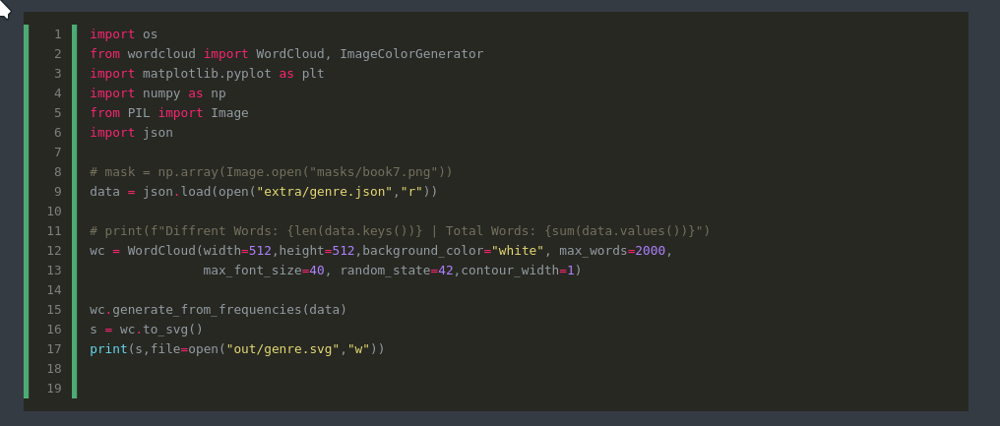

# Github  

Embed code from Github Repositories into Hugo Blog. Looks completely native, as if code was written in [highlight shortcode](https://gohugo.io/content-management/syntax-highlighting/#highlight-shortcode)  



## Usage  

``` hugo

```

*[Options Reference](https://gohugo.io/content-management/syntax-highlighting/#highlight-shortcode)*  
*[Language Reference](https://gohugo.io/content-management/syntax-highlighting/#list-of-chroma-highlighting-languages)*  
