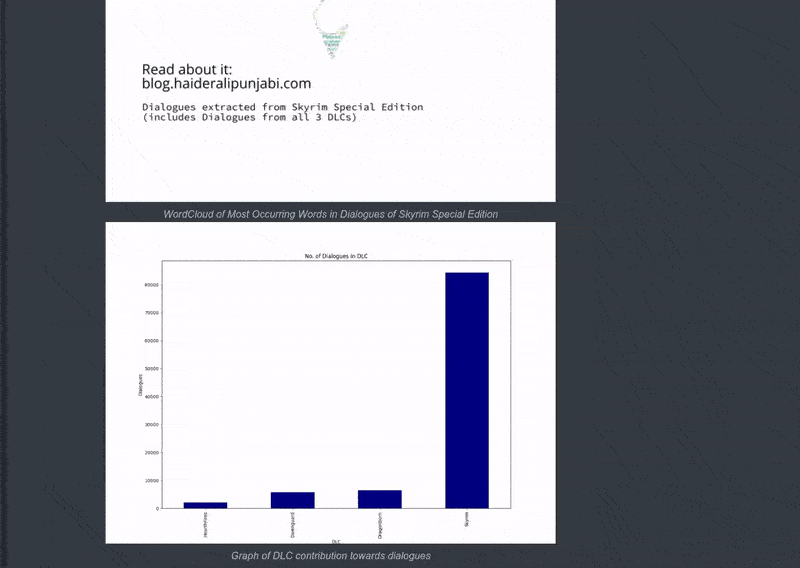

# Imgur  

Embed images from Imgur and have different sized images for thumbnail and preview.
[previewer by ajayns](https://github.com/ajayns/previewer) used for Preview



## Usage  

Include `previewer.min.css` & `previewer.min.js` from [previewer by ajayns](https://github.com/ajayns/previewer) in your base layout.

```html
<link rel="stylesheet" href="Path/To/previewer.css" />
<script src="Path/To/previewer.js" type="text/javascript"></script>
```

Also inititalize [previewer](https://github.com/ajayns/previewer)

```javascript
let previewer = new Previewer();
```

Use in your Hugo

``` hugo

```
